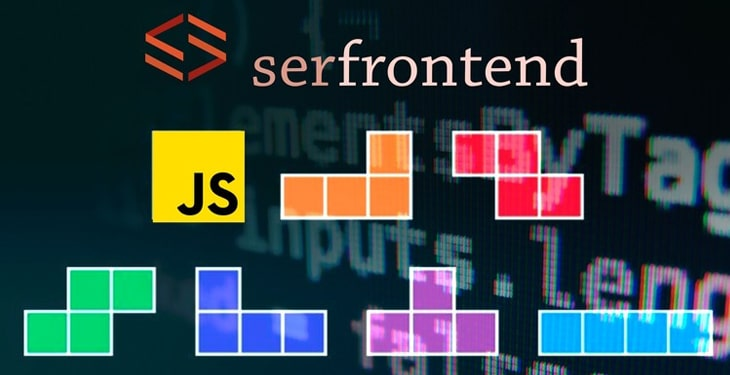

# Lógica de Programação com JavaScript 

- Aprenda a programar resolvendo problemas reais e crie seus primeiros códigos Javascript, seja para frontend ou não.

- Neste curso de lógica de programação e algorítmo utilizando Javascript você dará seus primeiros passos rumo ao desenvolvimento web. A didática é focada em problemas reais e à medida que o aluno avança nos exercícios propostos novos conhecimentos são adquiridos para formar uma base sólida de conhecimento, que pode ser utilizada tanto por aspirantes à programador frontend (utilizando Javascript) quanto para qualquer outra linguagem.

- Neste curso desenvolveremos códigos com base em exemplos práticos, onde o foco é desenvolver suas habilidades em lógica de programação.

- O grande diferencial deste treinamento é sua abordagem 100% prática. Antes de cada assunto, será apresentado um problema real.

- Você quer iniciar a carreira como desenvolvedor? Tenha certeza que este treinamento é um ótimo ponto de partida.

------------

[Link do curso](https://www.udemy.com/course/logica-de-programacao-com-javascript-iniciando-no-frontend/?utm_source=adwords&utm_medium=udemyads&utm_campaign=Webindex_Catchall_la.PT_cc.BR&utm_term=_._ag_114148736799_._ad_485704569539_._de_c_._dm__._pl__._ti_dsa-510684693277_._li_1031720_._pd__._&gclid=Cj0KCQiAlsv_BRDtARIsAHMGVSbVGEDNGm73WN1BfsKPY1eHDVShS0m9hnLvmS1kTKQ2iJL6Up38a6IaAgn7EALw_wcB "Link do curso")

